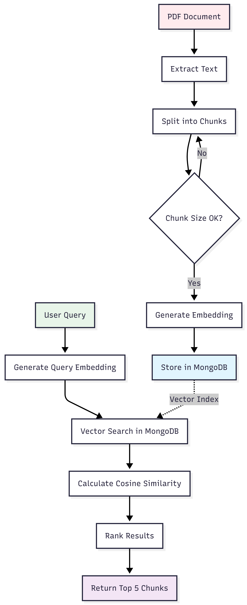
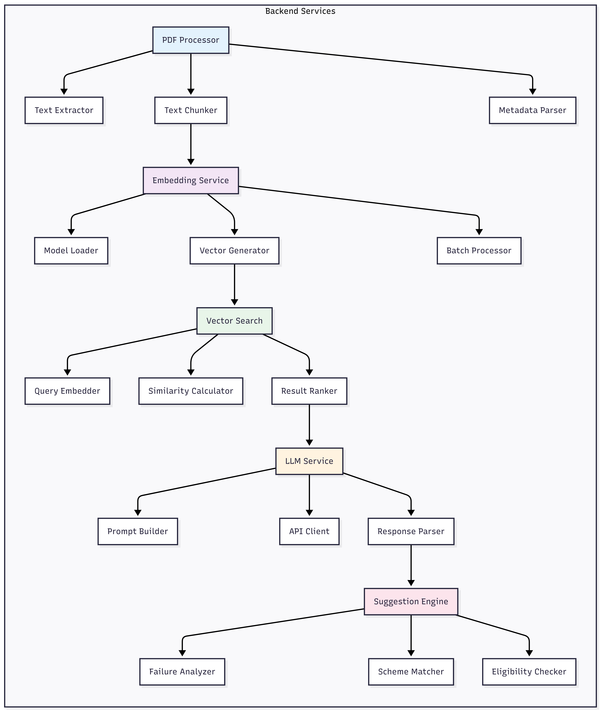

# Agricultural Scheme Eligibility System

**AI-Powered Voice Interface for Government Scheme Accessibility**

[]()
[]()
[]()

---

## Problem

The Indian government allocates over **₹50,000 crores** annually across **100+ agricultural schemes**, yet adoption remains below **30%**. The core barriers:

| Issue | Impact |
|-------|--------|
| **Complex Documentation** | Eligibility criteria buried in 50+ page PDFs with bureaucratic language |
| **Information Asymmetry** | Farmers cannot decode technical eligibility requirements |
| **High Rejection Rate** | 40-50% of applications rejected due to incomplete or incorrect submissions |
| **Limited Accessibility** | No tools to quickly verify eligibility before application effort |

**Result**: Eligible farmers miss benefits, government funds remain underutilized, and rural development stagnates.

---

## Solution

A **voice-first RAG (Retrieval-Augmented Generation) system** that transforms opaque policy documents into actionable eligibility decisions with verifiable proof.

### Core Innovation

```
Government PDF → AI Processing → Farmer Voice Input → Instant Eligibility Decision + Citation
```

**Key Capabilities:**

1. **Automated Document Processing**: Ingests official scheme PDFs, extracts eligibility criteria, creates searchable knowledge base
2. **Voice-Based Profiling**: Captures farmer details through Hindi/English voice input with form fallback
3. **RAG-Powered Analysis**: Matches farmer profile against vector-indexed document chunks using semantic search
4. **Citation-Backed Decisions**: Binary YES/NO eligibility with exact document quotes and page references
5. **Smart Recommendations**: When ineligible, suggests 2-3 alternative schemes with eligibility proof

---

## Architecture

### System Overview


The platform operates across five architectural layers:

**1. User Interface Layer** - React web application with voice capture, profile forms, and results visualization

**2. API Gateway** - Express.js REST endpoints handling profile management, scheme queries, and eligibility checks

**3. Business Logic** - Modular services for PDF processing, RAG orchestration, LLM interaction, and suggestion generation

**4. Data Layer** - MongoDB Atlas with vector search indexing for profiles, schemes, document chunks, and eligibility history

**5. External Services** - Groq API for LLM inference, speech-to-text for voice processing, local embeddings for semantic search

### RAG Pipeline


The eligibility determination follows this sequence:

1. **Profile Capture**: Voice transcription or manual form entry captures farmer details
2. **Query Formulation**: Profile converted to semantic query embedding (384 dimensions)
3. **Vector Search**: MongoDB vector index returns top 5 most relevant document chunks via cosine similarity
4. **LLM Analysis**: Groq LLM (Llama 3.1) evaluates profile against retrieved criteria
5. **Decision Extraction**: Structured JSON response with eligibility status, reasoning, and citation
6. **Alternative Discovery**: If ineligible, parallel checks against compatible schemes
7. **Result Presentation**: Proof card displays decision, document evidence, and next steps

### Data Flow



**PDF Processing Pipeline:**
- Extract text from government PDFs using pdf-parse
- Chunk text into 1000-character segments with 200-character overlap
- Generate 384-dimensional embeddings using sentence-transformers
- Store chunks with metadata (page, section) and vector embeddings in MongoDB

**Search Pipeline:**
- Convert user query to embedding vector using same model
- Execute vector search with cosine similarity ranking
- Return top 5 chunks sorted by relevance score
- Feed to LLM for final eligibility determination

### Component Architecture



**Backend Services:**

- **PDF Processor**: Text extraction, intelligent chunking, metadata parsing
- **Embedding Service**: Model loading, vector generation, batch processing
- **Vector Search**: Query embedding, similarity calculation, result ranking
- **LLM Service**: Prompt engineering, Groq API integration, response parsing
- **Suggestion Engine**: Failure analysis, scheme matching, parallel eligibility checks

---

## Technology Stack

### Core Infrastructure

| Layer | Technology | Justification |
|-------|-----------|---------------|
| **Frontend** | React.js | Component architecture, voice API support |
| **Backend** | Node.js + Express | JavaScript ecosystem alignment, async operations |
| **Database** | MongoDB Atlas | Vector search built-in, single-database simplicity |
| **LLM** | Groq API (Llama 3.1) | Fast inference (<2s), cost-effective free tier |
| **Embeddings** | Sentence Transformers | Local execution, no API costs, 384d vectors |
| **Voice** | Web Speech API | Browser-native, multilingual support |

### RAG Implementation

**Chunking Strategy**: 1000 characters with 200-character overlap to prevent context loss at boundaries

**Embedding Model**: `all-MiniLM-L6-v2` (384 dimensions, balanced performance/size)

**Vector Search**: MongoDB Atlas vector index with cosine similarity scoring

**LLM Prompting**: Structured system prompt enforcing citation requirements and JSON output format

---

## Data Model

### Collections

**schemes**
```javascript
{
  name: "PM-KISAN",
  description: "Direct income support for farmers",
  criteria: { maxLandHectares: 2, applicableStates: ["All"] },
  benefits: { amount: 6000, frequency: "Annual" },
  totalChunks: 45
}
```

**scheme_chunks** (with vector index)
```javascript
{
  schemeId: ObjectId,
  text: "All farmers with landholding up to 2 hectares...",
  embedding: [0.234, -0.123, ..., 0.456], // 384 dimensions
  metadata: { page: 4, section: "Eligibility Criteria" }
}
```

**farmer_profiles**
```javascript
{
  state: "Maharashtra",
  landHolding: 1.5, // acres
  landHoldingHectares: 0.607, // calculated
  cropType: "Wheat",
  category: "General"
}
```

**eligibility_checks**
```javascript
{
  farmerId: ObjectId,
  schemeId: ObjectId,
  eligible: true,
  citation: "All farmers with landholding up to 2 hectares...",
  citationSource: { page: 4, section: "Eligibility Criteria" },
  suggestions: [], // Alternative schemes if not eligible
  responseTime: 8.5
}
```

---

## API Specification

### Eligibility Check Endpoint

**Request:**
```http
POST /api/eligibility/check
Content-Type: application/json

{
  "profileId": "507f1f77bcf86cd799439012",
  "schemeName": "PM-KISAN"
}
```

**Response:**
```json
{
  "eligible": true,
  "confidence": "high",
  "reason": "Landholding (0.607 hectares) is below 2 hectare threshold",
  "citation": "All farmers with landholding up to 2 hectares are eligible for PM-KISAN benefits",
  "citationSource": {
    "page": 4,
    "section": "Eligibility Criteria",
    "paragraph": 3
  },
  "benefitAmount": 6000,
  "requiredDocuments": [
    "Aadhaar Card",
    "Land Records (7/12 extract)",
    "Bank Account Details"
  ],
  "suggestions": [], // Empty when eligible
  "responseTime": 8.2
}
```

**Ineligible Response with Suggestions:**
```json
{
  "eligible": false,
  "reason": "Land holding (3.2 hectares) exceeds PM-KISAN limit of 2 hectares",
  "citation": "Farmers with landholding up to 2 hectares are eligible",
  "suggestions": [
    {
      "schemeName": "PM-KUSUM (Solar Pump Scheme)",
      "eligible": true,
      "reason": "No land size limit for solar pump installation",
      "benefitAmount": 90000,
      "matchScore": 0.85,
      "citation": "All farmers with irrigation requirements are eligible..."
    },
    {
      "schemeName": "Agri-Infrastructure Fund",
      "eligible": true,
      "reason": "Designed for farmers with larger holdings",
      "benefitAmount": 200000,
      "matchScore": 0.72
    }
  ]
}
```

---

## Features

### MVP (Current Phase)

- [x] System architecture and component design
- [x] Database schema and vector index strategy
- [ ] PDF processing pipeline (text extraction, chunking, embedding)
- [ ] Vector search implementation with MongoDB Atlas
- [ ] Groq LLM integration with structured prompting
- [ ] Voice input capture (Hindi/English)
- [ ] Profile management API
- [ ] Eligibility check API with citation extraction
- [ ] Proof card UI component
- [ ] Dashboard with analytics

**Target Schemes**: PM-KISAN, PM-KUSUM, Agri-Infrastructure Fund

### Advanced Features (Phase 2)

- [ ] **Smart Suggestions**: Automated alternative scheme discovery when ineligible
- [ ] **Auto Form Filler**: Pre-populate application PDFs with farmer data using pdf-lib
- [ ] **Multilingual TTS**: Text-to-speech output in Hindi, Marathi, Tamil
- [ ] **Document Checklist**: Auto-generate required documents list per scheme
- [ ] **Scheme Comparison**: Side-by-side analysis of multiple eligible schemes
- [ ] **Application Tracker**: Real-time submission status monitoring

---

## Success Metrics

| Metric | Target | Measurement |
|--------|--------|-------------|
| **Accuracy** | 95%+ | Cross-validation against manual PDF review (10 test profiles) |
| **Response Time** | <10 seconds | End-to-end eligibility check including LLM inference |
| **Citation Precision** | 100% | All decisions must include exact document quote with page reference |
| **Voice Recognition** | 90%+ | Transcription accuracy for Hindi/English agricultural terminology |
| **Alternative Relevance** | 80%+ | Suggested schemes must match farmer profile when original ineligible |

---

## Implementation Status

**Phase 1: Planning & Architecture** ✅ Complete
- Problem analysis and solution design
- Technology stack selection
- High-level and low-level design documentation
- Database schema and API specification

**Phase 2: Backend Development** 🔄 In Progress
- PDF processing pipeline setup
- MongoDB vector index configuration
- Groq API integration and prompt engineering
- RAG engine implementation

**Phase 3: Frontend Development** ⏳ Upcoming
- React component architecture
- Voice input integration
- Results visualization
- Dashboard analytics

**Phase 4: Testing & Deployment** ⏳ Planned
- Accuracy validation with test dataset
- Performance optimization
- Production deployment to Vercel/Railway
- User acceptance testing

---

## Project Structure

```
agri-scheme-eligibility-rag/
├── docs/
│   ├── architecture/
│   │   ├── HLD.md                    # High-level design
│   │   ├── LLD.md                    # Low-level design
│   │   └── *.png                     # Architecture diagrams
│   ├── planning/
│   │   ├── problem-statement.pdf
│   │   └── implementation-plan.md
│   └── api/
│       └── API-DOCUMENTATION.md
├── backend/                           # Node.js + Express
│   ├── src/
│   │   ├── services/                 # PDF, RAG, LLM, Suggestions
│   │   ├── routes/                   # API endpoints
│   │   └── models/                   # MongoDB schemas
│   └── data/schemes/                 # Government PDFs
├── frontend/                          # React application
│   └── src/
│       ├── components/               # Voice, Profile, Results
│       └── services/                 # API client
└── README.md
```

---

## Development Timeline

| Week | Milestone | Deliverables |
|------|-----------|--------------|
| **1** | Foundation Setup | MongoDB Atlas, Groq API testing, PDF acquisition |
| **2** | Core Backend | PDF processor, embedding generation, vector search |
| **3** | RAG Engine | LLM integration, citation extraction, API endpoints |
| **4** | Frontend | Voice input, profile forms, proof cards |
| **5** | Extensions | Suggestion engine, alternative scheme matching |
| **6** | Testing | Accuracy validation, performance optimization |
| **7** | Deployment | Production setup, monitoring, documentation |
| **8** | Refinement | Bug fixes, UX improvements, demo preparation |

---

## Research Context

This system addresses a critical gap in agricultural technology: the "last mile" of policy implementation. While government digitization efforts focus on application portals, they neglect the discovery phase where farmers determine eligibility. By applying RAG techniques to policy documents, we create a zero-shot learning system that requires no scheme-specific training data—only official PDFs.

**Novel Contributions:**
1. Voice-first interface optimized for low-literacy rural contexts
2. Citation-backed decisions building trust through transparency
3. Smart suggestion engine using failure analysis and compatibility matching
4. Single-database architecture combining structured data and vector search

**Target Impact:**
- Increase scheme awareness and adoption rates
- Reduce application rejection through pre-verification
- Lower administrative burden on rural service centers
- Improve government spending efficiency

---

## License

MIT License - See [LICENSE](LICENSE) for details

---

## Contact

For questions, contributions, or collaboration opportunities, please open an issue or reach out via e-mail: patil.abhay214@gmail.com.

**Note**: This is a research and development project focused on agricultural technology innovation and AI accessibility.