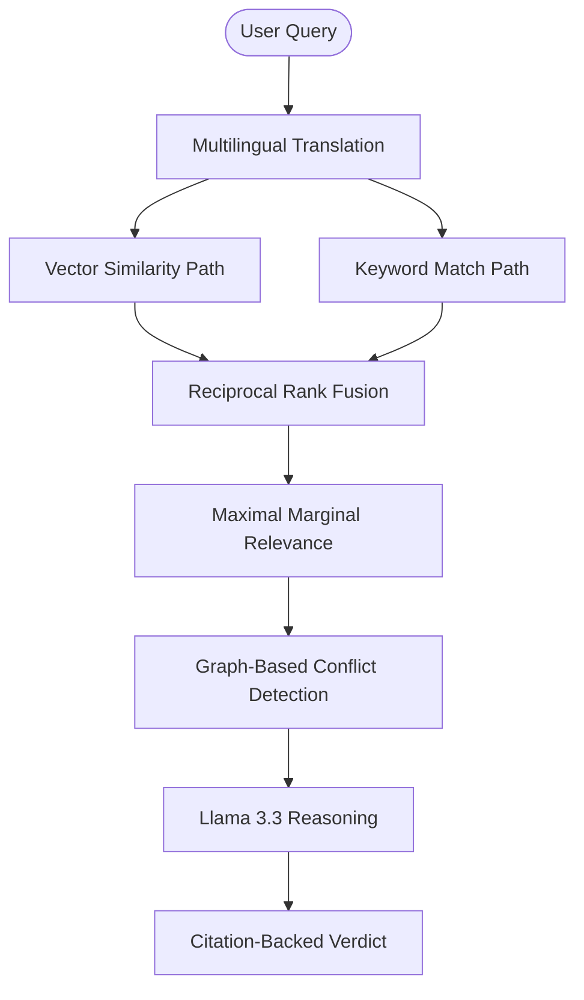

# Niti Setu (नीति सेतु) 🌾

AI-Powered Multilingual RAG Ecosystem for Indian Agricultural Schemes.

[](#key-features)
[](#technical-architecture)
[](#license)

Niti Setu is a professional-grade "last-mile" delivery engine for government
schemes. It uses **Retrieval-Augmented Generation (RAG)** to decode complex
policy PDFs and provide farmers with instant, citation-backed eligibility
decisions in their native language.

---

## Key Features

*   **Multilingual Support:** Native localization for 6 core languages:
    **Hindi, Marathi, Malayalam, Punjabi, Bengali, and English**.
*   **Krishi Mitra AI Assistant:** A floating, voice-enabled assistant
    supporting **Voice Dictation** (STT) and **Auto-Speech Synthesis** (TTS).
*   **Privacy-First (Zero-Storage):** Vision AI scans 7/12 extracts and Aadhaar
    documents in-memory without permanent storage.
*   **Advanced RAG Engine:** Hybrid search (Vector + BM25) with **MMR** for
    diversity and **Reciprocal Rank Fusion (RRF)** for precision.
*   **Massive Knowledge Base:** 35+ official PDFs across 9 priority sectors.
*   **Citation-Backed Decisions:** Every result includes verbatim quotes and
    page references for 100% verifiability.

---

## Technical Architecture

Niti Setu follows a modular, decoupled architecture designed for high
performance and strict data privacy.

| Layer | Technology | Role |
| :--- | :--- | :--- |
| **Frontend** | React 19, Vite, Framer Motion | Premium Glassmorphic UI/UX |
| **API Gateway** | Express.js, JWT, Helmet | Secure Orchestration & Rate Limiting |
| **Intelligence** | Groq (Llama 3.3/3.2), RRF | Core RAG & Vision Reasoning |
| **Storage** | MongoDB Atlas, Neo4j Aura | Vector Data & Knowledge Graph |
| **Voice** | Web Speech API, ElevenLabs | Multilingual STT/TTS |

### Hybrid RAG Intelligence Pipeline

The system utilizes a custom-built, native RAG implementation that prioritizes
factual density and retrieval diversity.



### Core Logic USPs

*   **Custom Native RAG:** Direct implementation of retrieval logic without 
    third-party black-box wrappers.
*   **Recursive Chunking:** Policies are split into 1000-character blocks with 
    200-character overlap to preserve semantic context.
*   **Unique Chunk Sovereignty:** Every chunk is SHA-256 hashed to ensure 
    uniqueness and prevent duplicate reasoning.
*   **MMR Diversity Filter:** Prevents redundant criteria from overwhelming the 
    LLM context window.
*   **Privacy Data Flow:** Optimized for DPDP compliance with a memory-only 
    buffer strategy for sensitive document scans.

---

## Installation and Setup

### 1. Clone & Install
```bash
git clone https://github.com/abhay-patil-cse27/agri-scheme-eligibility-rag.git
cd agri-scheme-eligibility-rag
npm install
```

### 2. Configure Environment
Create a `.env` file in the `backend/` directory based on the architecture
requirements provided in `backend/.env.example`.

### 3. Run Locally
```bash
# Start Backend
cd backend && npm run dev

# Start Frontend
cd frontend && npm run dev
```

---

## Documentation

Explore our deep-dive technical documents:

*   **[Technical Architecture](docs/ARCHITECTURE.md)**: Details on HLD, LLD, 
    and Data Flow diagrams.
*   **[Frontend Guide](docs/FRONTEND_GUIDE.md)**: Deep dive into the React 
    Design System and Glassmorphic components.
*   **[Backend Guide](docs/BACKEND_GUIDE.md)**: Implementation details of 
    databases, security, and the AI service layer.
*   **[Developer Guide](docs/DEVELOPER_GUIDE.md)**: Implementation details of 
    MMR, chunking, and search algorithms.
*   **[API Specification](docs/API_SPEC.md)**: Complete REST API documentation.
*   **[Privacy Policy](docs/PRIVACY_POLICY.md)**: Zero-storage protocol 
    details.

---

## License & Contact

Distributed under the MIT License. Created by **Abhay Patil** -
[patil.abhay214@gmail.com](mailto:patil.abhay214@gmail.com).

Project Link: [https://github.com/abhay-patil-cse27/agri-scheme-eligibility-rag](https://github.com/abhay-patil-cse27/agri-scheme-eligibility-rag)