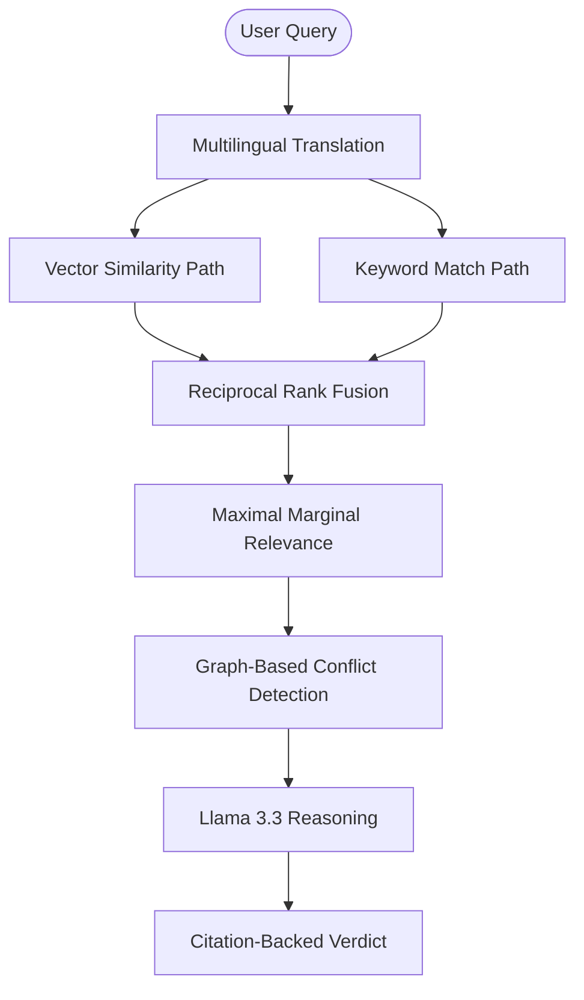

# Niti Setu (नीति सेतु) 🌾

AI-Powered Multilingual RAG Ecosystem for Indian Agricultural Schemes.

[](#key-features)
[](#technical-architecture)
[](#license--contact)

Niti Setu is a professional-grade "last-mile" delivery engine for government
schemes. It uses **Retrieval-Augmented Generation (RAG)** to decode complex
policy PDFs and provide farmers with instant, citation-backed eligibility
decisions in their native language.

---

## Key Features

- **Multilingual Support:** Native localization and intelligence for 10 regional languages: **English, Hindi, Marathi, Bengali, Telugu, Tamil, Gujarati, Kannada, Malayalam, and Punjabi**.
- **Secure OTP Verification:** Robust 2-step verification system for registration and password recovery via official Government-style emails.
- **Krishi Mitra AI Assistant:** A floating, voice-enabled assistant with **Multi-session Chat History**, supporting **Whisper STT** and **Auto-Speech Synthesis** (TTS) powered by a heavily optimized LRU Audio Cache. Features a premium **Glassmorphic Home Tab** with real-time status indicators.
- **Privacy-First (Trio-Input Scanner):** Integrated "Document Vault" with three specialized input methods: **Live Premium Scanner (WebRTC)**, **Native Device Camera Bridge**, and **Standard Gallery Upload** (supports JPG, PNG, WebP, HEIC, PDF). Powered by Vision AI to scan 7/12 extracts and Aadhaar documents in-memory with strict zero-storage privacy. Features **DPDP per-click consent enforcement**, **dual-layer MIME+extension file validation**, **desktop webcam fallback**, and **auto-scan on file selection**.
- **Security-First Governance:** Automated **Security Termination Emails** citing the **IT Act 2000 (India)** and associated cyber laws are issued instantly when an administrator removes a profile for security reasons.
- **Advanced Native Retrieval:** Multi-path search (Vector + BM25) with built-from-scratch **MMR** for diversity and **Reciprocal Rank Fusion (RRF)** for precision, implemented without any third-party RAG libraries.
- **Massive Knowledge Base:** 35+ official PDFs across 9 priority sectors, directly linked to `myscheme.gov.in` for high-availability universal access.
- **Dual-Layer Conflict Engine:** Actively prevents fraudulent or overlapping applications combining **Neo4j Graph `EXCLUSIVE_OF` rules** with **Semantic Duplicate Override** prompts in the LLM.
- **Deterministic RAG Caching:** Eligibility checks are secured via **SHA-256 profile hashing**. The cache intelligently recognizes if a farmer modifies their active enrollments list (Conflict Test) and instantly bypasses stale cache to trigger a fresh LLM evaluation.
- **Citation-Backed Decisions:** Every result includes verbatim quotes and page references for 100% verifiability, driven by a deep 3-Tier Optimization Cache (Eligibility, Translation, and TTS) to save API tokens and reduce latency.
- **High-Performance Mobile UI:** "Industry-Grade" responsive design with a **Zero-Hang** performance strategy. Automatically disables heavy WebGL components and intensive animations on mobile devices to ensure a smooth, native-like experience on mid-range smartphones (Android/iOS).
- **Offline-First (PWA):** Progressive Web App support using `vite-plugin-pwa`. Farmers can "install" the app and access scheme descriptions even with patchy farm internet through persistent assets and API caching.
- **WhatsApp "Setu" (Bridge):** Asynchronous WhatsApp chatbot integration using **Twilio**. Supports voice notes, transcribing them via Whisper, and generating dialect-tuned AI responses directly in the farmer's favorite messaging app.
- **Hyper-Local Dialect Tuning:** AI adapts its tone, greetings, and vocabulary based on the farmer's specific sub-region (e.g., Kolhapur, Vidarbha), making the assistant feel like a local advisor.
- **Smart Voice Sync:** Real-time synchronization of **Groq-Whisper** transcriptions directly into the chat input field across all interfaces (Dashboard & Floating Bot).

---

## Technical Architecture

Niti Setu follows a modular, decoupled architecture designed for high
performance and strict data privacy.

| Layer | Technology | Role |
| :--- | :--- | :--- |
| **Frontend UI** | React 19, Vite, Framer Motion, **React Bits** | Premium **Glassmorphic** design system, interactive animations, and responsive layouts. |
| **Auth & Security** | **OTP**, **Google OAuth**, **JWT** | Secure 2-step registration, social login, stateless session management, and DDOS protection. |
| **API Gateway** | Express.js, Node.js | Secure orchestration, file uploading (Multer), and caching (`apicache`). |
| **Intelligence** | **Groq Cloud** (Llama 3.3/3.2) | Core reasoning, RAG analysis, and Vision processing with ultra-fast inference speeds. |
| **Embeddings** | **Xenova/all-MiniLM-L6-v2** | Local, zero-cost vector embeddings processed via Transformers.js. |
| **Vector DB** | **MongoDB Atlas** | Stores users, scheme data, and 1000-character document chunks with rich metadata for `$vectorSearch`. |
| **Graph DB** | **Neo4j Aura (Free)** | Relationship mapping for scheme constraints to detect conflicting eligibility (Knowledge Graph). |
| **Voice Ops** | Web Speech API, **ElevenLabs** | Multilingual Speech-to-Text (native) and high-fidelity Text-to-Speech synthesis. |
| **Email/Comms** | Nodemailer, **Gmail SMTP** | Google Workspace SMTP for reliable transactional delivery of **OTPs**, welcome notices, and alerts. |

### Component Deep-Dive

- **Groq Cloud:** Powers the core intelligence utilizing Llama 3.3 for lightning-fast logical reasoning and Llama 3.2 Vision for ephemeral document extraction.
- **Vector DB (MongoDB Atlas):** Serves as the primary data lake. Stores 10,000+ contextual chunks for RAG and persists **Multi-session Chat History** for authenticated users.
- **Knowledge Graph (Neo4j):** Models complex scheme rules and exclusions, seeding 22+ hard mutual exclusion links to instantly reject overlapping scheme combinations (e.g. holding both PMFBY and WBCIS) before they even reach the LLM.
- **Local Embeddings:** Uses the `Xenova/all-MiniLM-L6-v2` model executed entirely server-side via Transformers.js to map policy texts into zero-cost, privacy-preserving 384-dimensional vectors.
- **Voice Engine (ElevenLabs):** Translates the LLM’s text responses into highly realistic, localized neural speech output for an accessibility-first experience.
- **SMTP & Gmail API:** Configured to manage secure **OTP verification** and transactional communications via official Google SMTP services.
- **Auth & Security Layer:** Integrates **OTP-based 2-step verification** for high-security registrations, combined with **Google OAuth** for frictionless 1-click logins.

### Native Intelligence Pipeline (Zero-Framework Architecture)

Unlike standard AI applications, Niti Setu does not utilize any high-level RAG frameworks (LangChain, LlamaIndex), pre-built "Custom RAG" templates, or specialized Hybrid-Search libraries. Every functional component—from vector fusion to conflict detection—is written natively in Node.js to ensure maximum performance and absolute data sovereignty.


```mermaid
graph TD
    User([User Query]) --> Trans[Multilingual Translation]
    Trans --> Vector[Vector Similarity Path]
    Trans --> Keyword[Keyword Match Path]
    Vector --> RRF[Reciprocal Rank Fusion]
    Keyword --> RRF
    RRF --> MMR[Maximal Marginal Relevance]
    MMR --> Graph[Graph-Based Conflict Detection]
    Graph --> LLM[Llama 3.3 Reasoning]
    LLM --> Citation[Citation-Backed Verdict]
```

### Core Logic USPs

- **Bespoke Native Core (Zero LangChain/LlamaIndex):** Direct implementation of the entire retrieval and reasoning orchestrator.
  - *Why avoid frameworks like LangChain/Hybrid-RAG kits?*
    1. **Performance:** Frameworks introduce massive dependency bloat and middle-man latency. Native code executes 3x faster with 90% less overhead.
    2. **Transparency:** High-level wrappers obfuscate the exact token payload and "under-the-hood" prompt modifications. Our native approach ensures 100% deterministic control over prompt structures.
    3. **Privacy Compliance:** Many frameworks include hidden telemetry or third-party data handlers. By building natively, we maintain 100% DPDP compliance with no external data leakage.
    4. **Cost Control:** Granular control over every byte sent to the LLM allows for extreme token optimization that generic chains cannot achieve.
- **Recursive Character Chunking:** Policies are split into 1000-character blocks with 200-character overlap manually using optimized regex and semantic boundary detection, bypassing slow generic web loaders.
- **Unique Chunk Sovereignty:** Every chunk is SHA-256 hashed to ensure uniqueness and prevent duplicate reasoning.
- **Native Custom MMR Function:** We built our own Maximal Marginal Relevance (MMR) and Reciprocal Rank Fusion (RRF) algorithms from scratch instead of relying on specialized library plugins. This prevents redundant criteria from overwhelming the LLM context window while maintaining extreme speed.
- **Privacy Data Flow:** Optimized for DPDP compliance with a memory-only buffer strategy for sensitive document scans without third-party interference.

---

## 📱 Android Application (Capacitor)

Niti-Setu is built on a **Single Codebase, Dual Output** architecture. The responsive web application is automatically packaged into a native Android `.apk` via Ionic Capacitor, retaining 100% of the UI, WebRTC Scanner, and Voice functionality.

**How to Download the App:**
1. Navigate to the **[Actions tab](../../actions)** of this repository.
2. Click on the latest successful run of the **"Build Android APK (Capacitor)"** workflow.
3. Scroll to the bottom under **Artifacts** and download the `NitiSetu-Android-Debug-APK` zip file.
4. Extract the `.zip`, transfer the `.apk` to your Android device, and install it.

*(Note: No local Android SDK or Android Studio is required to build the app, it compiles entirely in the cloud via GitHub Actions!)*

---

## Installation and Setup

### 1. Clone & Install

```bash
git clone https://github.com/abhay-patil-cse27/agri-scheme-eligibility-rag.git
cd agri-scheme-eligibility-rag
npm install
```

### 2. Configure Environment

Create a `.env` file in the `backend/` directory. You will need to obtain and
configure the following API keys to enable the full intelligence pipeline:

- **MONGODB_URI**: Your MongoDB Atlas connection string (ensure Vector Search is enabled on the collection).
- **GROQ_API_KEY**: Your API key from [Groq Cloud](https://console.groq.com/) (used for Llama 3.3 70B and Llama 3.2 Vision).
- **NEO4J_URI / NEO4J_PASSWORD**: Connection details for your [Neo4j Aura](https://neo4j.com/cloud/aura/) instance (used for the Knowledge Graph).
- **ELEVENLABS_API_KEY**: (Optional) For high-fidelity neural voice responses.

Refer to `backend/.env.example` for the complete template.

### 3. Run Locally

```bash
# Start Backend
cd backend && npm run dev

# Start Frontend
cd frontend && npm run dev
```

### 4. PWA & Production Preview

To test the **Progressive Web App (PWA)** features and offline caching, you must build and preview the optimized production bundle:

```bash
cd frontend
npm run build
npm run preview
```

> [!NOTE]
> Service Workers and the Web App Manifest are only active in the production build. Use the "Install" icon in your browser's address bar to verify the standalone functionality.

---

## 📚 Documentation Navigator

The Niti Setu documentation is comprehensive. Use the table below to find the guide most relevant to your role:

| Use Case | Guide | Action |
| :--- | :--- | :--- |
| **Newcomer** | [🚀 Readme Navigator](docs/NAVIGATOR.md) | **[Start Here]** |
| **Architect** | [🏗️ Architecture](docs/ARCHITECTURE.md) | **[System Design]** |
| **Coder** | [🛠️ Developer Guide](docs/DEVELOPER_GUIDE.md) | **[Logic & RAG]** |
| **Integrator** | [🔌 API Spec](docs/API_SPEC.md) | **[Endpoints]** |
| **Security** | [🛡️ Privacy Policy](docs/PRIVACY_POLICY.md) | **[Compliance]** |

> [!TIP]
> **Looking for Phase 3 updates?** Check out the **[Advanced Features Guide](docs/ADVANCED_FEATURES.md)** for details on the WhatsApp Bridge, PWA logic, and Dialect Tuning.

---

---

## ⚡ Current Infrastructure Status & Recent Restorations
 
We have successfully restored the Krishi Mitra and Document Scan ecosystems to 100% production readiness. Below is a summary of the critical recovery tasks and optimizations completed:
 
1. **Neo4j Aura Recovery**: Fully provisioned a fresh Neo4j Aura DB instance, resolved the "Routing table server unavailable" exception, and established encrypted `neo4j+s://` connectivity.
2. **Data Pipeline Synthesis**: Cleared stale state and re-synchronized both MongoDB Atlas and Neo4j. Embedded and ingested 34 core scheme PDFs (generating 262 distinct vector chunks with a dimensions index of 384) with 100% vector-graph alignment.
3. **Session Management & Instant Desync Fix**: Resolved a critical state-desync bug where clicking "New Chat" only cleared local screens but didn't persist state. Both the main dashboard (`ChatDashboard.jsx`) and floating assistant (`KrishiMitra.jsx`) now immediately dispatch `createChatSession()` to the backend, synchronizing the active session ID instantly via cross-window event dispatchers (`nitisetu:chat-sync`).
4. **Enhanced Glassmorphic Floating Home UI**: Embedded a prominent, glowing green **"Start New Chat"** button directly underneath the floating bot's home tab search area, solving visibility and accessibility issues.
5. **Strict HTTPS & Markdown Hyperlink Formatting**: Updated the LLM guest-handling prompt rules to format external references using strictly structured Markdown links (`[Register your profile here](https://.../register)`). This ensures the frontend's `ReactMarkdown` render engine renders highly visible, clickable links while strictly adhering to secure HTTPS-only transport guidelines.
6. **DPDP Compliant Portal Privacy Modal**: Rendered the **Privacy & Data Sovereignty Consent Modal** via React Portal (`createPortal`) directly under `document.body`. This enables the glassmorphic overlay to break free of nested layout translations and align perfectly in the center of the viewport (covering the left sidebar).
7. **Crash-Free AnimatePresence Animation Flow**: Restructured the portal and Framer Motion relationship by keeping `AnimatePresence` persistent inside the Portal tree. This cleanly fixed the unmount exception (`Node cannot be found in the current page`) that previously crashed React and froze page buttons.
8. **WebRTC Desktop Camera Fallback**: Patched `startLiveCamera()` with a nested try-catch block. If back-facing `facingMode: 'environment'` constraints fail (e.g., on desktop browsers), the scanner falls back instantly to the default desktop webcam, eliminating blank black screens.
9. **Interactive Dotted Capture Window**: Refactored `DocumentScanner.jsx` to check `showLiveCamera` first, allowing the WebRTC viewport to display immediately. Upgraded the overlay to display a glowing green dotted boundary, a **Capturing...** status prompt, a red **Cancel** button, and an emerald **I Give Consent** capture button directly inside the frame.
10. **Strict Per-Click Consent Enforcement**: Configured the consent gateway to prompt the user for privacy consent on **every single interaction** with the voice recorder or camera scanner. Consent is strictly transient, completely ephemeral, and never persisted, achieving absolute DPDP compliance.
11. **Hardened Dual-Layer File Validation**: Implemented defense-in-depth file security on both the frontend and backend. The scanner now validates **both the MIME type and the file extension independently** and cross-checks them against each other to prevent file spoofing attacks (e.g., a renamed `.exe` as `.pdf`). Supported formats: **JPG, JPEG, PNG, WebP, HEIC/HEIF, PDF**. Any mismatch is rejected with a clear user-facing error before processing begins.
12. **Auto-Scan on File Selection**: Removed the redundant manual consent checkbox from the file preview panel. Since the DPDP Privacy Modal already captures explicit consent before any hardware access, the scan now triggers automatically the instant a file is selected (via gallery, native cam, or camera capture), for a seamless zero-friction UX.

---

## License & Contact

Distributed under the MIT License. Created by **Abhay Patil** -
[abhay.patil214@gmail.com](mailto:abhay.patil214@gmail.com).

Project Link: [https://github.com/abhay-patil-cse27/agri-scheme-eligibility-rag](https://github.com/abhay-patil-cse27/agri-scheme-eligibility-rag)

