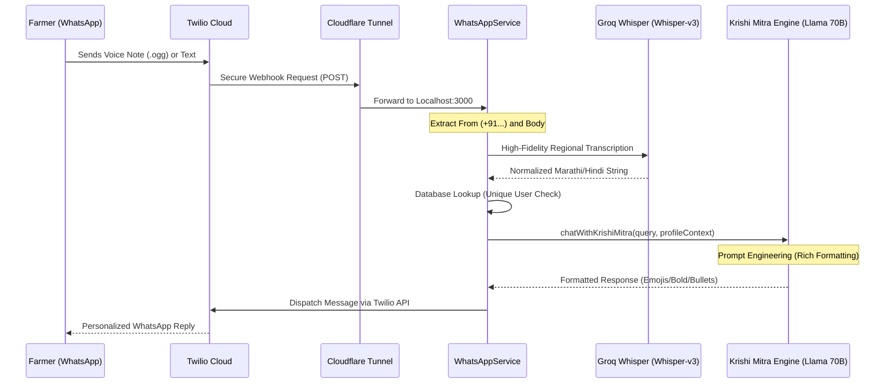
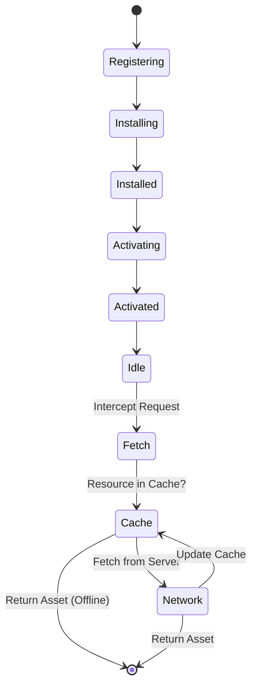
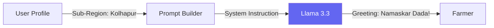
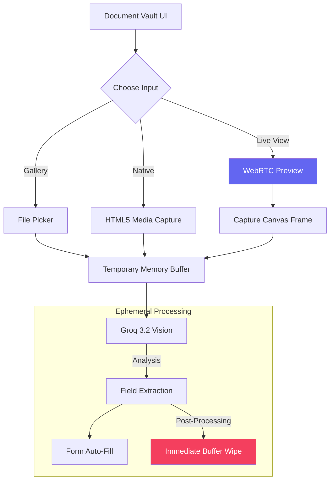

# Niti Setu: Advanced Features & "Industry-Grade" Enhancements

This guide documents the high-end features added during the Phase 3 optimization.

## 1. WhatsApp "Krishi Mitra" AI Gateway 📱

An industry-grade, voice-centric messaging bridge that democratizes AI access for rural populations. It transforms WhatsApp from a simple chat app into a sophisticated agricultural portal.

### Technical Interaction Lifecycle



### Security & ID Governance (Unique User Protocol)

The system enforces a **Strict Identity Governance** model to ensure data integrity and prevent double-dipping in schemes:

1.  **Unique Identity Linking**:
    - Every incoming WhatsApp message is hashed and compared against the `FarmerProfile` database using the sender's phone number as a **Primary Unique Key**.
    - This ensures that a single WhatsApp account maps to exactly one **Unique User** in the backend.

2.  **Multimodal Registry Checks**:
    - **Registered Users**: Receive a "Premium Personalized Experience" including greetings by name, hyper-local dialect tuning, and direct links to their private *Eligibility History*.
    - **Unregistered Guests**: Are identified instantly. The system serves a "Guided Public Response" that includes a warm welcome, a high-level answer, and an automated registration nudge to convert them into verified users.

3.  **Dynamic Response Architecting**:
    - The AI engine uses **Contextual Prompt Injection** to change its tone. If the user is a guest, it prefixes the response with a registration notice: *"We have noticed that you are not registered with Niti Setu yet!"* to drive user acquisition.

### Robust Local Tunneling & Fallbacks

To handle real-world network challenges, the gateway uses a **Cloudflare Quick Tunnel** (Argo based). Unlike standard tunnels, this provides:
- **Zero-Block Webhooks**: Bypasses browser-based "reminder pages" that typical tunnels use, ensuring 100% 24/7 delivery of Twilio payloads.
- **End-to-End Encryption**: Secure HTTPS transit between the Twilio Cloud and the Niti Setu local development server.

#### 🆘 Troubleshooting: I/O Timeout?
If your ISP (e.g., Jio, Airtel) blocks Cloudflare's Argo lookups, you may see a "DNS Lookup Timeout" error. In such cases, use the **LocalTunnel Fallback** provided in our automation suite.

### Setup & Deployment Guide ⚙️

Follow these steps to establish the agriculture-to-AI bridge:

1. **Environmental Configuration**:
   Append the following to your `backend/.env`:

   ```env
   TWILIO_ACCOUNT_SID=AC...
   TWILIO_AUTH_TOKEN=your_token
   TWILIO_WHATSAPP_NUMBER=whatsapp:+14155238886 (Twilio Sandbox)
   FRONTEND_URL=your_deployed_or_tunnel_url
   ```

2. **Initialize Secure Tunnel**:
   You can now start both the backend server and the Cloudflare tunnel in a single industry-grade operation:

   ```bash
   cd backend
   npm run dev:full
   ```

   *Alternative (Manual - Cloudflare):*
   ```bash
   npm run tunnel
   ```

   *Alternative (Backup - LocalTunnel):* 🛠️
   If Cloudflare fails (I/O Timeout), run this to use LocalTunnel:
   ```bash
   npm run tunnel:alt
   ```
   *Note: Copy the `https://*.loca.lt` URL generated.*

3. **Twilio Webhook Configuration**:
   - Access the [Twilio Console](https://console.twilio.com/).
   - Navigate to: **Messaging** > **Try it out** > **Send a WhatsApp message**.
   - Click the **Sandbox settings** tab.
   - In the **"WHEN A MESSAGE COMES IN"** field, paste your URL with the API suffix:
     `https://your-unique-id.trycloudflare.com/api/whatsapp/webhook`
     *(Or your `*.loca.lt` URL if using the backup)*
   - Set the method to **POST** and click **Save**.

4. **Synchronize Device**:
   Send the specific "join" code (e.g., `join stretch-unusual`) to the Twilio number from your WhatsApp device to link it to the sandbox environment.

---

## 2. Offline-First (PWA) 📶

Enables native-like application behavior and resilience on poor networks.

### Service Worker Lifecycle



### Caching Strategy

- **Core Assets:** Pre-cached on install (JS, CSS, localized images).
- **Google Fonts:** Cached via Workbox `CacheFirst` strategy.
- **Scheme Documents:** Cached via `NetworkFirst` to ensure farmers see valid PDFs even if disconnected temporarily.

### Verification & Production Testing

PWA features (Service Workers and Manifest) are only active in **Production Mode**. To verify the implementation, follow these steps:

1. **Build the Application:**

   ```bash
   cd frontend
   npm run build
   ```

2. **Preview the Build:**

   ```bash
   npm run preview
   ```

   _This serves the optimized production files locally._

3. **Install Test:**
   - Open the preview URL in Chrome or Edge.
   - Look for the **Install Icon** (computer with a down arrow) in the address bar.
   - Click to install Niti Setu as a standalone app.

4. **Technical Audit (DevTools):**
   - **Application Tab:** Check "Service Workers" (should be Running) and "Manifest" (should show icons and theme colors).
   - **Lighthouse Tab:** Run a "Progressive Web App" report to confirm 100% compliance.

5. **Mobile Testing:**
   - Run `npm run tunnel` to get a secure public URL.
   - Open the URL on a smartphone.
   - Use **"Add to Home Screen"** to verify native-like behavior.

---

## 3. Hyper-Local Dialect Tuning 🗣️

Adapts the AI's persona to sound like a "Local Brother" rather than a computer.



### Translation Architecture

- **Tier 1 (Literal):** Transcribing regional voice (Whisper).
- **Tier 2 (Semantic):** LLM understands intent (Satbara, Loan, etc.).
- **Tier 3 (Transcreation):** Converting robotic English into warm, local Marathi/Hindi "Agricultural Tone".

---

---

## 5. Trio-Input Document Vault (Vision AI) 📸

A high-end "Document Fast-Fill" system that leverages multi-path camera inputs to automate profile creation.

### Input Architecture

1. **Standard Gallery:** Standard file upload for high-res document scans.
2. **Live Premium Scanner:** An in-app, real-time video preview for precision alignment and instant capture.
3. **Native Cam Bridge:** A direct fallback to the device's native camera hardware for better auto-focus and flash control.

### Camera Interaction Lifecycle



### Technical Implementation

- **WebRTC Integration:** Uses `getUserMedia` to stream 720p/1080p video directly into a glassmorphic preview window.
- **Canvas Capturing:** Captures a frame from the `<video>` stream, converts it to a `Blob`, and then to an ephemeral `File` object for backend transmission.
- **Privacy First:** Unlike traditional KYC apps, no images are ever persisted to disk; they exist only as an in-memory buffer on the backend and are wiped the instant the JSON extraction is complete.
