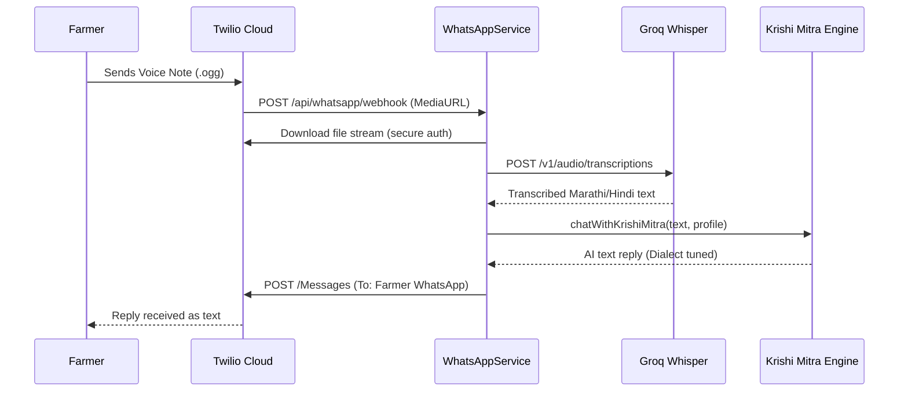
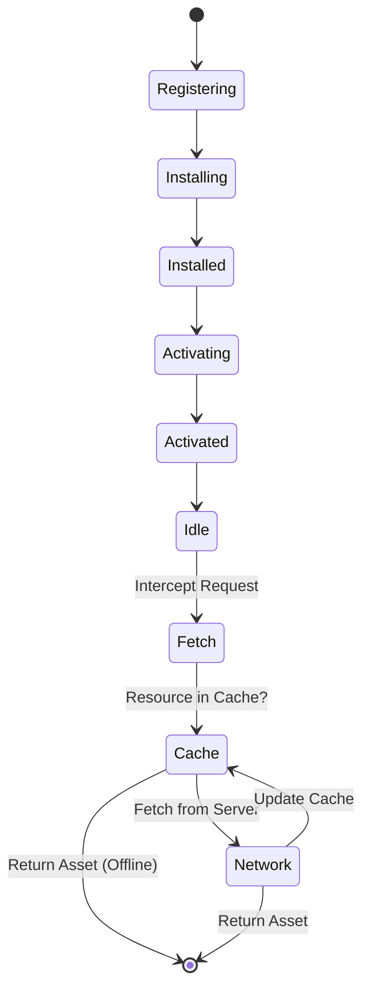
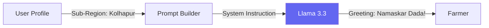
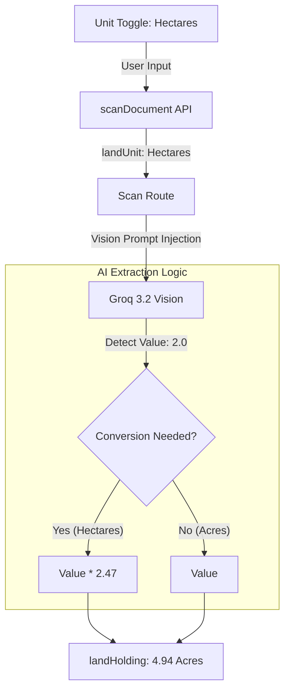

# Niti Setu: Advanced Features & "Industry-Grade" Enhancements

This guide documents the high-end features added during the Phase 3 optimization.

## 1. WhatsApp "Setu" (Bridge) 📱

A voice-note-centric gateway for farmers who prefer messaging apps over web browsers.

### Interaction Flow

### Profile Linking
Users are identified by their WhatsApp contact number (linked in `FarmerProfile`). If no profile exists, the AI provides general guidance and encourages registration.

---

## 2. Offline-First (PWA) 📶

Enables native-like application behavior and resilience on poor networks.

### Service Worker Lifecycle

### Caching Strategy

- **Core Assets:** Pre-cached on install (JS, CSS, localized images).
- **Google Fonts:** Cached via Workbox `CacheFirst` strategy.
- **Scheme Documents:** Cached via `NetworkFirst` to ensure farmers see valid PDFs even if disconnected temporarily.

---

## 3. Hyper-Local Dialect Tuning 🗣️

Adapts the AI's persona to sound like a "Local Brother" rather than a computer.

### Translation Architecture

1. **Tier 1 (Literal):** Transcribing regional voice (Whisper).
2. **Tier 2 (Semantic):** LLM understands intent (Satbara, Loan, etc.).
3. **Tier 3 (Transcreation):** Converting robotic English into warm, local Marathi/Hindi "Agricultural Tone".

---

## 4. OCR Unit-Conversion Bridge 🔍

Ensures precise land extraction regardless of the document's regional unit.

