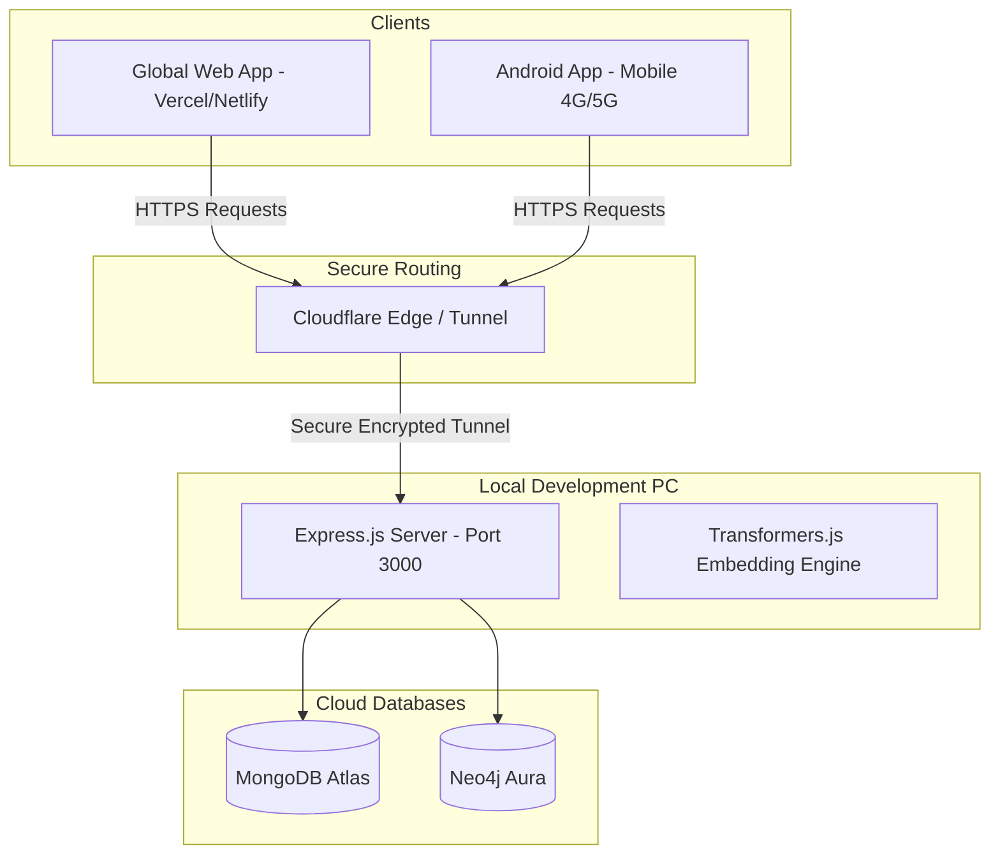

# Niti-Setu Global Access & Deployment Plan 🌐

This document outlines the architecture and execution steps to expose the local Niti-Setu backend (`localhost:3000`) and React frontend to the public internet. This enables both the **Global Web App** and the **Android App (on cellular networks)** to interact seamlessly with your local development machine.

---

## 🏗️ Architectural Overview

Since MongoDB Atlas and Neo4j Aura are already hosted in the cloud, our only remaining challenge is routing public traffic safely to the Express backend running on your PC.



---

## 🛠️ Phase 1: Exposing the Backend (The Cloudflare Tunnel Way)

Instead of using temporary links (like localtunnel/ngrok free tier) which change every time you restart your PC, **Cloudflare Tunnels** provide a **100% free, highly stable, and secure permanent HTTPS URL** that routes directly to your PC.

### Step 1: Install Cloudflare Daemon (`cloudflared`)
1. Download `cloudflared` for Windows from [Cloudflare's Downloads Page](https://github.com/cloudflare/cloudflared/releases).
2. Add it to your System PATH or run it directly from your terminal.

### Step 2: Authenticate and Create Tunnel
Open PowerShell in your workspace and run:
```powershell
# 1. Login to your Cloudflare account
cloudflared tunnel login

# 2. Create a tunnel named "nitisetu-backend"
cloudflared tunnel create nitisetu-backend
```
*This generates a unique Tunnel ID and credentials file on your system.*

### Step 3: Configure the Tunnel
Create a configuration file `config.yml` in your Cloudflare directory:
```yaml
tunnel: <YOUR-TUNNEL-ID>
credentials-file: C:\Users\Admin\.cloudflared\<YOUR-TUNNEL-ID>.json

ingress:
  - hostname: api.nitisetu.in # Or a free Cloudflare subdomain/quick tunnel
    service: http://localhost:3000
  - service: http_status:404
```

### Step 4: Run the Tunnel
Start the tunnel daemon to bind your local backend to the global edge network:
```powershell
cloudflared tunnel run nitisetu-backend
```

---

## 📱 Phase 2: Updating the Android App for Global Access

Once your Cloudflare Tunnel is live (providing an address like `https://api.nitisetu.in`), we must configure the Android compiler to build a production-ready APK targeting it.

1. Open [`.github/workflows/android-build.yml`](file:///d:/Projects/nitiSetu/agri-scheme-eligibility-rag/.github/workflows/android-build.yml).
2. Update the `VITE_API_URL` variable to point to your secure Cloudflare hostname:
   ```yaml
   env:
     VITE_API_URL: https://api.nitisetu.in/api
     NODE_ENV: production
   ```
3. Commit and push the changes.
4. GitHub Actions will automatically compile a new APK. Download and install it on your phone.
5. **Validation:** Turn off Wi-Fi on your phone, open the app over 4G/5G, and test the system. It will route natively to your local PC.

---

## 💻 Phase 3: Global Web App Deployment (Vercel / Netlify)

To deploy the frontend to Vercel/Netlify for global access while still using your local PC as the backend processing powerhouse:

### Step 1: Push Frontend to Vercel
1. Sign up on [Vercel](https://vercel.com) and link your GitHub account.
2. Select your repository `agri-scheme-eligibility-rag`.
3. Set the **Root Directory** to `frontend`.
4. Configure the **Environment Variables** in the Vercel Dashboard:
   - `VITE_API_URL` = `https://api.nitisetu.in/api`

### Step 2: Configure CORS on Backend
To prevent modern browsers from blocking requests from your Vercel domain, your Express backend must allow it.
1. Open your backend `app.js` or `server.js` file.
2. Ensure your CORS configuration permits incoming requests from Vercel:
   ```javascript
   app.use(cors({
     origin: ['http://localhost:5173', 'https://nitisetu.vercel.app'],
     credentials: true
   }));
   ```

---

## 📈 Phase 4: Full Cloud Transition (Optional / Production Release)

If you eventually want to turn off your local PC and have the entire system live 24/7 in the cloud:

| Service | Best Cloud Option | Action Required |
| :--- | :--- | :--- |
| **Frontend** | Vercel / Netlify | Free hosting, autodeploys on every git push. |
| **Backend API** | Railway.app / Render.com | Deploy the `backend/` folder. Add GROQ, Mongo, and Neo4j environment keys. |
| **Database** | MongoDB Atlas / Neo4j Aura | Already fully cloud-hosted! No changes needed. |
| **Embeddings** | Cloud Container | Transformers.js can run serverless inside the Railway container, keeping embeddings free. |
